.. _setup:

Setup
=======================

This tutorial guides you through the processes and settings for installing the required software and packages for the ACon Sumo openCV programm.

Installing the required software
----------------------------------

Install the following software on your computer

* `Microsoft Visual Studio 2017 Community Edition <https://www.visualstudio.com/downloads/>`_ 
* `Cmake Gui (Version 3.9.1 or higher) <https://cmake.org/download/>`_
* `QT (Version 5.9.x or higher) <https://www.qt.io/download-open-source/>`_ (you need to create a free Account)

.. _msvs:

Microsoft Visual Studio 2017 Community
~~~~~~~~~~~~~~~~~~~~~~~~~~~~~~~~~~~~~~~~~
During the installation process, select **Desktop Development with C++** (Desktopentwicklung mit C++)

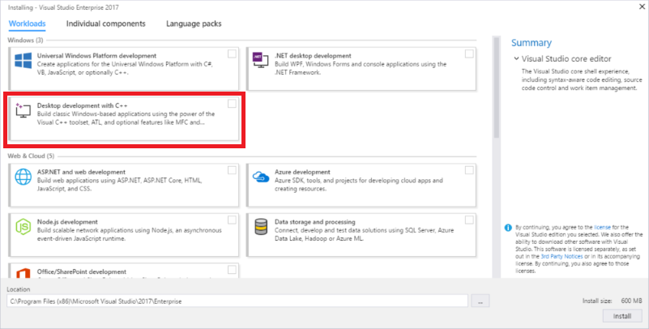

After installing, add Visual Studio Compilers to your paths. You may need to restart your computer afterwards or just kill the *explorer.exe* task in the task manager and execute *explorer.exe* again.

.. tip::
    On Windows 10, go to *Settings*, click on *System*. Then on the left side click *About* and select *System info* at the bottom or at the top right hand side. In the new Control Panel window that opens, click *Advanced system settings* on the left. Now in the new window that comes up, select *Environment Variables...* at the bottom.

    Now select **Path** and *System variables* and click **Edit** and then **New**. Add the path to the *bin* folder. For example:
    ``C:\Program Files (x86)\Microsoft Visual Studio\2017\Community\VC\Tools\MSVC\14.x.x\bin``

.. _qt:

QT Open Source
~~~~~~~~~~~~~~~~~~~~~~~~~~~~~~~~~~~~~~~~~
During the installation process, make sure you have ``msvc2017_64`` selected. You can uncheck every other component to save space.

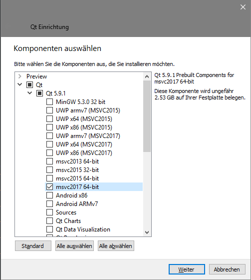

Download openCV source files
--------------------------------
1. Download openCV master source files. Either download the .zip file from https://github.com/opencv/opencv or checkout using Git
``https://github.com/opencv/opencv.git``

2. Download openCV contrib modules. Either download the .zip file from https://github.com/opencv/opencv_contrib or checkout using Git
``https://github.com/opencv/opencv_contrib.git``

It is recommended to use a folder structure similar to this::

    -- opencv
        |- build
        |- opencv-contrib
        |- opencv-master

Unzip the downloaded source files to their respective folder.

Create your own openCV Build
-----------------------------
Start **Cmake Gui**

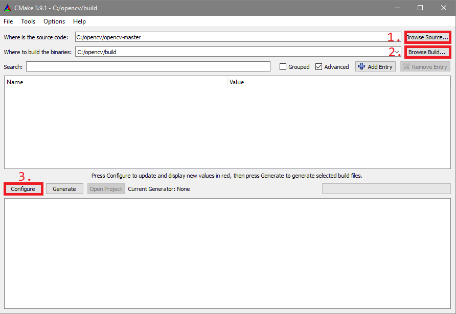

1. Click *Browse source...* and locate ``opencv-master`` folder
2. Click *Browse build...* and locate ``build`` folder
3. Press *Configure*

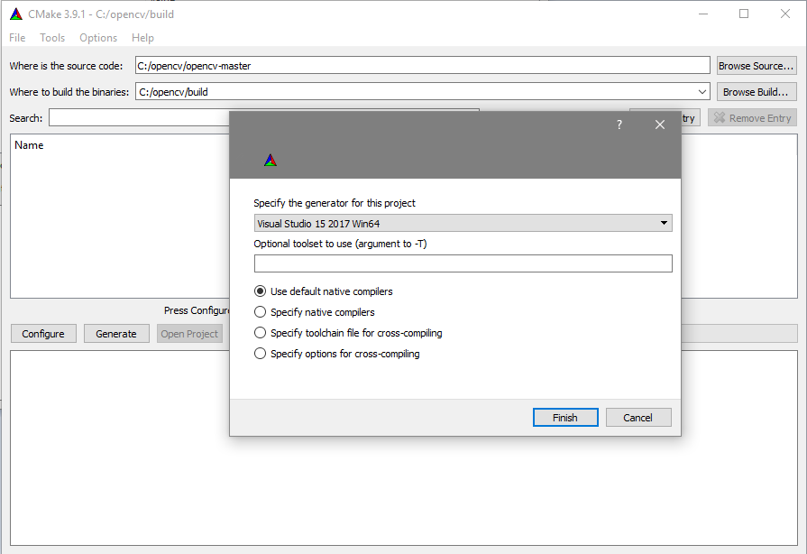

4. Select the Generator. For example ``Visual Studio 15 2017 Win64`` and select ``Use default native compilers``
5. Press *Finish*

.. note:: 
    This only works if you added the correct Path to your Environment Variables. If you get an error, check the :ref:`msvs` Section again. 

6. After configuration is done, it should look similar to this

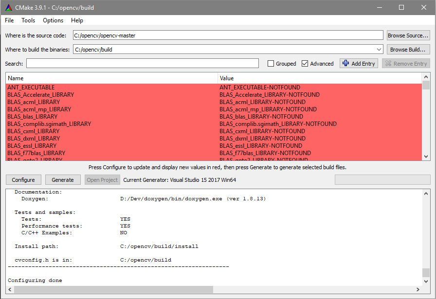

7. Now you need to specify the following values (Use search function)

+------------------------------+--------------------------------------------------------------------------------------+
| Name                         | Value                                                                                |
+==============================+======================================================================================+
| OPENCV_EXTRA_MODULES_PATH    | path to modules, eg: ``C:/opencv/opencv-contrib/modules``                            |
+------------------------------+--------------------------------------------------------------------------------------+
| OPENCV_ENABLE_NONFREE        | ENABLE                                                                               |
+------------------------------+--------------------------------------------------------------------------------------+
| BUILD_DOCS                   | DISABLE (optional, greatly reduces build time)                                       |
+------------------------------+--------------------------------------------------------------------------------------+

8. Press *Configure* again. New values are displayed in red.

+-------------------------------+---------+
| Name                          | Value   |
+===============================+=========+
| BUILD_opencv_aruco            | ENABLE  |
+-------------------------------+---------+
| BUILD_opencv_ccalib           | ENABLE  |
+-------------------------------+---------+
| BUILD_opencv_xfeatures2d      | ENABLE  |
+-------------------------------+---------+
| BUILD_opencv_contrib_world    | DISABLE |
+-------------------------------+---------+
|                               |         |
+-------------------------------+---------+
| WITH_QT                       | ENABLE  |
+-------------------------------+---------+

9. You'll get the following error

.. error:: 
    Error in configuration process, project files may be invalid.

This is normal. You have to specify the ``QT5 paths``. For this, you have to search inside your *QT* installation folders. It is assumed that you installed QT in ``C:/QT/5.9.1``. Please set it according to your installation folder:

+-----------------------+------------------------------------------------------+
| Name                  | Value                                                |
+=======================+======================================================+
| QT_QMAKE_EXECUTABLE   | ``C:/QT/5.9.1/msvc2017_64/bin/qmake.exe``            |
+-----------------------+------------------------------------------------------+
| Qt5Concurrent_DIR     | ``C:/QT/5.9.1/msvc2017_64/lib/cmake/Qt5Concurrent``  |
+-----------------------+------------------------------------------------------+
| QT5Core_DIR           | ``C:/QT/5.9.1/msvc2017_64/lib/cmake/Qt5Core``        |
+-----------------------+------------------------------------------------------+
| QT5Gui_DIR            | ``C:/QT/5.9.1/msvc2017_64/lib/cmake/Qt5Gui``         |
+-----------------------+------------------------------------------------------+
| QT5Test_DIR           | ``C:/QT/5.9.1/msvc2017_64/lib/cmake/Qt5Test``        |
+-----------------------+------------------------------------------------------+
| QT5Widgets_DIR        | ``C:/QT/5.9.1/msvc2017_64/lib/cmake/Qt5Widgets``     |
+-----------------------+------------------------------------------------------+

.. note:: 
    If you don't have the ``msvc2017_64`` folder, check the :ref:`qt` Section again. 

10. Press *Configure* again. It'll show a new error and ask for the ``QT5OpenGL_DIR``

+-----------------------+------------------------------------------------------+
| Name                  | Value                                                |
+=======================+======================================================+
| QT5OpenGL_DIR         | ``C:/QT/5.9.1/msvc2017_64/lib/cmake/Qt5OpenGL``      |
+-----------------------+------------------------------------------------------+

11. Press *Configure* again.

12. Press **Generate**.

13. Inside the ``build`` folder open the Visual Studio Solution File ``OpenCV.sln`` with Microsoft Visual Studio. 

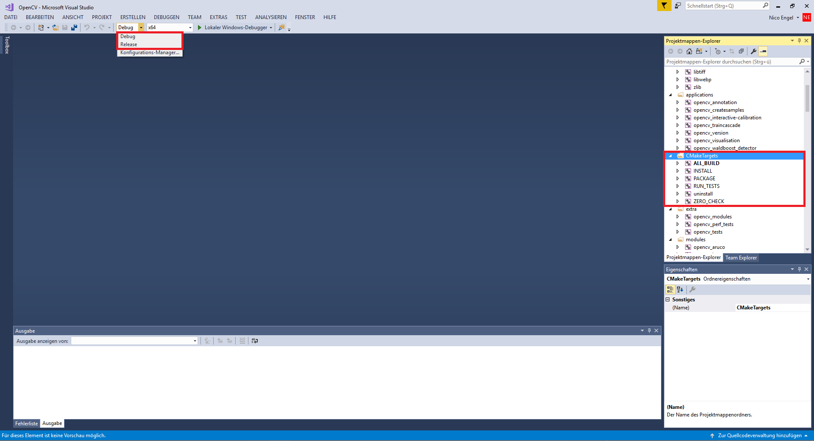

14. Select the right configuration (Debug vs Release). 

.. tip::
    It is recommended that you build the **Release** Configuration because it is a lot faster.

Rightclick on **ALL_BUILD** and then **build**. Afterwards rightclick on **INSTALL** and click **build** again. 

15. Sit back and drink a coffee. This may take a while.

16. If there are no errors, there should be a new ``install`` folder inside your ``build`` folder.

Congratulations! You build your own openCV build with additional contrib modules and QT. 

Build your own ACon Sumo opencv program
---------------------------------------------

1. Download ACon Sumo openCV source files. Either download the .zip file from https://github.com/gfre/sumo_opencv or checkout using Git
``https://github.com/gfre/sumo_opencv.git``

.. note:: 
    Check if the ``master`` branch is up to date. Otherwise checkout the ``develop`` branch

2. Open the Visual Studio Solution file ´´sumo_opencv.sln´´ with Microsoft Visual Studio. 

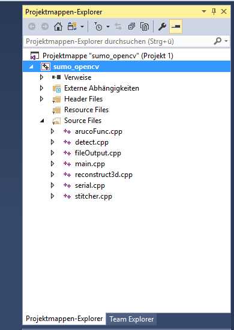

3. Make sure you select the correct Configuration (Release).

4. In the Solution Explorer, rightclick on **sumo_opencv** and select *Properties*. The go to **C/C++** and specify **Additional Include Directories**

+--------------------------------+-------------------------------------------------------------------------+
| Name                           | Value                                                                   |
+================================+=========================================================================+
| Additional Include Directories | ``C:\opencv\build\install\include``                                     |
+--------------------------------+-------------------------------------------------------------------------+

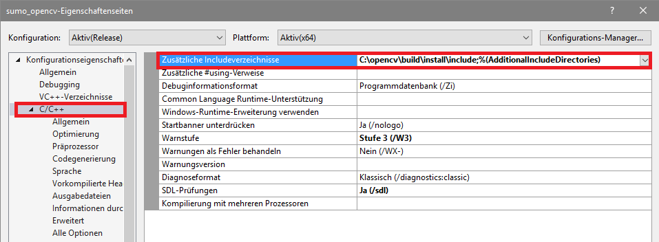

5. Under **Preprocessor**, add the following entry

+--------------------------+---------------------------+
| Name                     | Value                     |
+==========================+===========================+
| Preprocessor definitions | CRT_SECURE_NO_WARNINGS    |
+--------------------------+---------------------------+

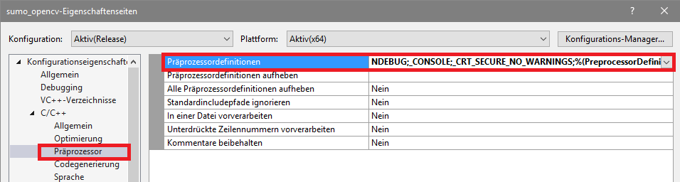

6. Under **Linker**, add the following entry to **Additional Library Directories**

+--------------------------------+------------------------------------------------------------------------------------------------+
| Name                           | Value                                                                                          |
+================================+================================================================================================+
| Additional Library Directories | ``C:\opencv\build\install\x64\vc15\lib``                                                       |
+--------------------------------+------------------------------------------------------------------------------------------------+

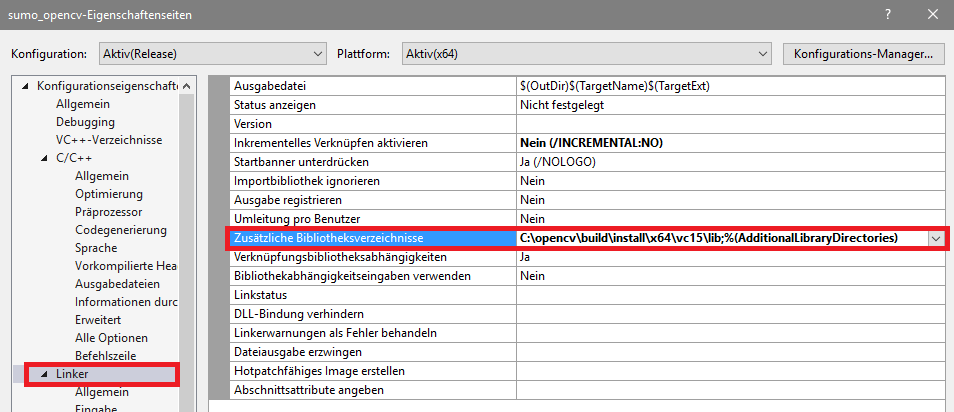

7. Under **Input**, add the following entries to **Additional Dependencies**::

    opencv_arucoXXX.lib
    opencv_calib3dXXX.lib
    opencv_coreXXX.lib
    opencv_features2dXXX.lib
    opencv_flannXXX.lib
    opencv_highguiXXX.lib
    opencv_imgcodecsXXX.lib
    opencv_imgprocXXX.lib
    opencv_stitchingXXX.lib
    opencv_videoXXX.lib
    opencv_videoioXXX.lib
    opencv_videostabXXX.lib
    opencv_xfeatures2dXXX.lib

.. note::
    Change XXX according to your openCV Version. For example: Version 3.2.0 it would be ``opencv_aruco320.lib`` etc. Check your ``C:\opencv\build\install\x64\vc15\lib`` folder if you are not sure. 
    

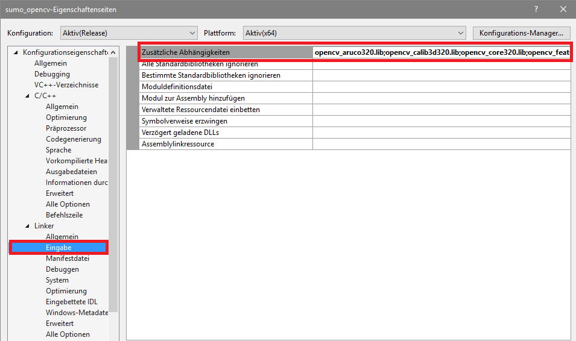

8. Now you're ready to go and you can build the project by either pressing ``Ctrl+Shift+B`` or by rightclicking on **sumo_opencv** and selection **build**. 
You may get an error that soem .dll files cannot be found. In that case navigate to your ``build folder`` and copy all the required dll's to your ``sumo_opencv project folder``

Copy the dll's::

    opencv_arucoXXX.dll
    opencv_calib3dXXX.dll
    opencv_coreXXX.dll
    opencv_features2dXXX.dll
    opencv_flannXXX.dll
    opencv_highguiXXX.dll
    opencv_imgcodecsXXX.dll
    opencv_imgprocXXX.dll
    opencv_stitchingXXX.dll
    opencv_videoXXX.dll
    opencv_videoioXXX.dll
    opencv_videostabXXX.dll
    opencv_xfeatures2dXXX.dll
    
from

``C:\opencv\build\install\x64\vc15\bin``

to 

``sumo_opencv project folder/sumo_opencv``

Additionally you need to copy the QT5 dll files::

    Qt5Concurrent.dll
    Qt5Core.dll
    Qt5Gui.dll
    Qt5OpenGl.dll
    Qt5Test.dll
    Qt5Widgets.dll    
    
from 

``C:/QT/5.9.1/msvc2017_64/bin``

to 

``sumo_opencv project folder/sumo_opencv``

.. note:: 
    It may be possible that you need additional openCV dll files. In that case just copy them too.

.. note::
    (Optional) If you want to run the programm from an executabel file (sumo_opencv.exe), you need to copy the exact same dll files to
    ``sumo_opencv project folder/x64/Release``
    or Debug respetively. Also make sure, that the camera calibration .xml file is in the ``x64/Relese`` or ``x64/Debug``. 
    Camera Calibration is covered in a later chapter.

9. After succesfully building the project a command prompt should open and close immediately. You're now ready to install and connect the camera. Proceed to the next section.

Troubleshooting
-----------------

- TBA - 

If you're experiencing any errors, please contact your supervisor or send me an email.